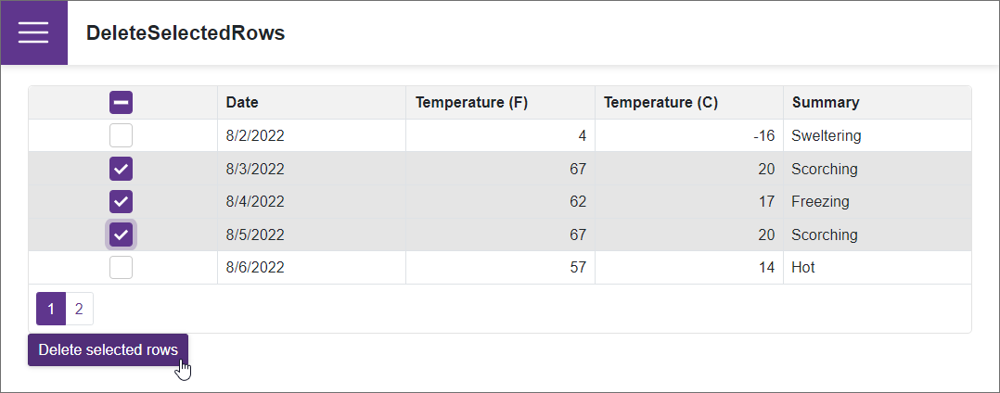

<!-- default badges list -->

<!-- default badges end -->
# Grid for Blazor - How to delete selected rows

This example demonstrates how to delete selected rows from the [DxGrid](https://docs.devexpress.com/Blazor/DevExpress.Blazor.DxGrid) when a user clicks a [DxButton](https://docs.devexpress.com/Blazor/DevExpress.Blazor.DxButton).

The selection column allows users to select one or multiple rows depending on the [SelectionMode](https://docs.devexpress.com/Blazor/DevExpress.Blazor.DxGrid.SelectionMode) property value. To create this column, declare a [DxGridSelectionColumn](https://docs.devexpress.com/Blazor/DevExpress.Blazor.DxGridSelectionColumn) object in the [Columns](https://docs.devexpress.com/Blazor/DevExpress.Blazor.DxGrid.Columns) template.

Implement [two-way binding](https://docs.devexpress.com/Blazor/402330/common-concepts/two-way-data-binding) for the [SelectedDataItems](https://docs.devexpress.com/Blazor/DevExpress.Blazor.DxGrid.SelectedDataItems) property to access data items that correspond to selected rows. Add a **Delete selected rows** button to the page and delete the selected data items when a user [clicks](https://docs.devexpress.com/Blazor/DevExpress.Blazor.DxButton#handle-the-click-event) this button.

## Files to Look At

- [Index.razor](./CS/DeleteSelectedRows/Pages/Index.razor)

## Documentation

- [Grid: Selection](https://docs.devexpress.com/Blazor/403143/grid#selection)
- [Grid: Bind to Data](https://docs.devexpress.com/Blazor/403737/grid/bind-to-data)

## More Examples

- [Grid for Blazor - How to display a custom confirmation dialog](https://github.com/DevExpress-Examples/blazor-DxDataGrid-show-the-confirmation-dialog-before-deleting-a-record)
